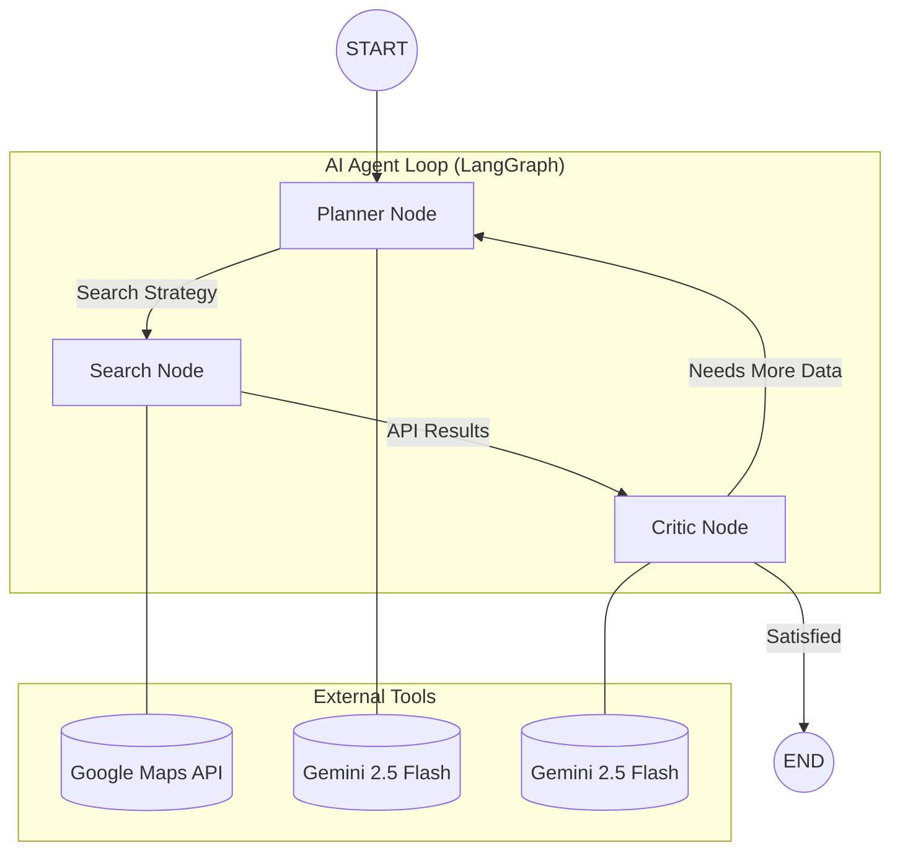

# Real Estate Marketing AI Agent

A tool that takes a property address and automatically generates professional marketing copy using real nearby amenity data from Google Maps and AI writing from Gemini.

---

## Overview

- **LangGraph Agent**: Implements a Planner, Search, and Critic loop to ensure amenities are relevant to the specified buyer profile.
- **Live Streaming (SSE)**: The agent's reasoning and search activity are streamed to the interface in real time via Server-Sent Events.
- **Clean Interface**: A professional Roboto-based UI with floating cards and layered elevation.
- **How It Works Panel**: A built-in five-step flowchart explaining the agentic pipeline.

---

## Prerequisites

- A computer running Windows
- Python 3.10 or newer ([Download here](https://www.python.org/downloads/))
- A Google account
- An active internet connection

> When installing Python, ensure the **"Add Python to PATH"** checkbox is selected on the first installer screen.

---

## Step 1: Get Your Google Maps API Key

This key allows the app to search for nearby places and convert addresses into coordinates.

### 1.1 Create a Google Cloud Project

1. Go to [console.cloud.google.com](https://console.cloud.google.com/)
2. Sign in with your Google account
3. Click the project dropdown at the top of the page
4. Click **New Project**
5. Enter a project name (e.g. `real-estate-agent`) and click **Create**
6. Confirm your new project is selected in the dropdown before proceeding

### 1.2 Enable Billing

Google requires a linked billing account to use their APIs. New accounts receive a **$300 free credit**, and typical usage of this application costs very little.

1. In the left sidebar, click **Billing**
2. Click **Link a billing account** and follow the prompts to add a payment method

### 1.3 Enable the Required APIs

**Geocoding API** (converts an address into coordinates):
1. In the sidebar, go to **APIs and Services > Library**
2. Search for **Geocoding API**
3. Click the result and click **Enable**

**Places API** (finds nearby MRT stations, malls, schools, etc.):
1. Return to the Library
2. Search for **Places API**
3. Click the result and click **Enable**

### 1.4 Create an API Key

1. In the sidebar, go to **APIs and Services > Credentials**
2. Click **+ Create Credentials** and select **API key**
3. Copy the generated key (it will look like `AIzaSyAbc123ExampleKey...`) and store it securely

> Never share this key publicly or commit it to version control. The `.gitignore` file in this project already excludes the `.env` file from being tracked by Git.

---

## Step 2: Get Your Gemini API Key

This is a separate key from the one above. Gemini is the AI model responsible for writing the marketing copy.

1. Go to [aistudio.google.com/apikey](https://aistudio.google.com/apikey)
2. Sign in with your Google account if prompted
3. Click **Create API Key**
4. Select the Google Cloud project created in Step 1 from the dropdown
5. Click **Create API key in existing project** and copy the key

---

## Step 3: Add Your API Keys to the `.env` File

The project includes an empty `.env` file ready to be populated.

1. Open the `.env` file in any text editor (right-click the file and select **Open with > Notepad**)
2. Add the following lines, replacing the placeholder values with your actual keys:

```
GOOGLE_MAPS_API_KEY=paste_your_google_maps_key_here
GEMINI_API_KEY=paste_your_gemini_key_here
```

3. Save the file (`Ctrl + S`) and close it

> Do not add quotation marks or spaces around the key values. Paste them directly after the `=` sign.

---

## Step 4: Open a Terminal in the Project Folder

1. Open File Explorer and navigate to the project folder
2. Click on the address bar at the top of the window
3. Type `cmd` and press **Enter**

A Command Prompt window will open in the project directory, showing something like:

```
C:\Users\YourName\...\singapore_real_estate>
```

---

## Step 5: Create a Virtual Environment

A virtual environment isolates this project's dependencies from other Python projects on your machine.

Run:

```cmd
python -m venv venv
```

Then activate it:

```cmd
venv\Scripts\activate
```

Your terminal prompt should now show `(venv)` as a prefix:

```
(venv) C:\Users\YourName\...\singapore_real_estate>
```

> Each time you open a new terminal for this project, you will need to re-run the activation command. The included `start.bat` file handles this automatically.

---

## Step 6: Install Dependencies

With the virtual environment active, run:

```cmd
pip install -r requirements.txt
```

This downloads all required packages. The process may take one to two minutes. When complete, you should see a line similar to:

```
Successfully installed flask-... requests-... ...
```

---

## Step 7: Run the Application

The simplest way to start the app is via the included `start.bat` file.

**Option A — Double-click:** Navigate to the project folder in File Explorer and double-click `start.bat`.

**Option B — Run from terminal:**
```cmd
start.bat
```

### What `start.bat` does automatically:

1. Checks that Python is installed
2. Checks that the `.env` file exists and is populated
3. Installs any missing packages from `requirements.txt`
4. Opens the app in your default browser
5. Starts the Flask development server

> To stop the server, click on the terminal window and press `Ctrl + C`.

---

## Architecture



---

## How the Agent Works

The application runs an agentic loop rather than a single one-shot search, in order to ensure the results are genuinely relevant to the specified buyer.

1. **Planner (Gemini 2.5 Flash):** Analyses the buyer profile and selects the three to five most relevant amenity categories to search for.
2. **Searcher (Google Maps API):** Queries the Google Places database for real places with names, ratings, and distances. No LLM is involved at this stage.
3. **Critic (Gemini 2.5 Flash):** Reviews the search results against the buyer's needs. If the results are insufficient, the loop returns to the Planner with specific feedback on what is missing and what categories have already been searched.
4. **Copy Generator:** Once the agent is satisfied, it writes the final marketing paragraph using only the verified amenity data.

Amenities accumulate across iterations rather than being replaced, so each loop cycle produces a richer dataset than the last.

---

## Project Structure

```
singapore_real_estate/
├── app.py                 # Flask entry point and SSE routing
├── agent/
│   ├── graph.py           # LangGraph workflow and conditional routing
│   ├── nodes.py           # Planner, Searcher, and Critic node logic
│   └── state.py           # Shared agent state (TypedDict)
├── services/
│   ├── geocode.py         # Google Maps Geocoding API wrapper
│   ├── amenities.py       # Google Places Nearby Search and Haversine distance
│   ├── ranking.py         # Filtering and distance-based ranking
│   └── copy_generator.py  # Gemini marketing copy prompt and generation
├── frontend/
│   ├── index.html
│   ├── styles.css
│   └── script.js          # SSE client and DOM rendering
├── start.bat              # One-click Windows launcher
└── .env                   # API keys (excluded from version control)
```

---

## Troubleshooting

| Problem | Solution |
|---------|----------|
| `python` is not recognised | Python is not installed or was not added to PATH. Reinstall Python and select "Add to PATH" during setup. |
| `pip` is not recognised | Ensure the virtual environment is activated by running `venv\Scripts\activate`. |
| `[ERROR] .env file not found` | Create the `.env` file and populate it with your API keys as described in Step 3. |
| App opens but returns an API error | Verify that both keys in `.env` are correct and that the Geocoding and Places APIs are enabled in Google Cloud. |
| Port 5000 is already in use | Another process is occupying the port. Restart your machine and try again. |

---

## Developed by

Lim Yuxuan Chloe

---

## License

This project is intended for educational and demonstration purposes.
